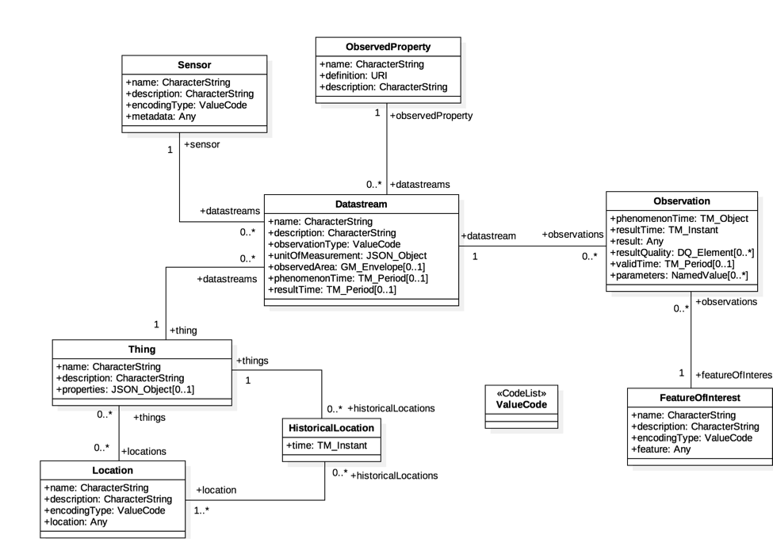

# The OGC SensorThings API

The SensorThings API (STA) is a dedicated Open Geospatial Consortium (OGC) standard for making data from IoT-systems available over the web. Version 1.0 was released in 2016 and described the Sensing part {cite}`sta_1.0`. This was extended by a Tasking part in 2019  {cite}`sta_1.0_tasking`. Currently, STA is available in version 1.1 {cite}`sta_1.1` while a release of the next version 2.0 is planned for late 2025.

The *core* of STA consists of a lightweight and generic data model as well as an API that follows the REST-principles. As STA is tailored towards ressource-constrained IoT-appilcations, it also features efficient JSON encoding as well as the usage of MQTT- and OASIS OData protocols. 



## The basic STA data model

In this section, we briefly explain the core data model of STA. For further details, please refer to the respective documentation.

### Thing

A STA Thing is the central entity for describing the infrastructure that is measuring something. In our typical use-cases, this could be, e.g., a simple climate station, a rover or even a complex system that consists of multiple sensors. According to the core model, a Thing holds the attributes *name*, *description*, and *properties*.

Within our DataHub ecosystem, a *Thing* is the equivalent to a *Configuraiton* in the Sensor Management System (Reference)

```{table} Table 1: Properties of a Thing entity (re-used from ...)
:name: tbl-thing-properties
:class: thing-table
:align: center

| Name        | Definition                                                                 | Data type       | Multiplicity and use |
|-------------|------------------------------------------------------------------------------|-----------------|----------------------|
| **name**        | A property provides a label for Thing entity, commonly a descriptive name. | CharacterString | One (mandatory)      |
| **description** | This is a short description of the corresponding Thing entity.             | CharacterString | One (mandatory)      |
| **properties**  | A JSON Object containing user-annotated properties as key–value pairs.     | JSON Object     | Zero-to-one          |
```

### Location & Historical Location

A Thing can have a *Location* as well as one (or multiple) *HistoricalLocation*

```{table} Table 2: Properties of a Location entity
:name: tbl-location
:class: thing-table
:align: center

| Name         | Definition                                                                | Data type   | Multiplicity and use   |
|--------------|---------------------------------------------------------------------------|------------|------------------------|
| name         | Label for the Location.                                                   | CharacterString | One (mandatory)    |
| description  | Description of the Location.                                              | CharacterString | One (mandatory)    |
| encodingType | Encoding of the `location` property (ValueCode).                          | ValueCode   | One (mandatory)        |
| location     | Location content; type depends on `encodingType` (e.g., GeoJSON).         | Any         | One (mandatory)        |
```

### Sensor 

```{table} Table 3: Properties of a Sensor entity
:name: tbl-sensor
:class: thing-table
:align: center

| Name         | Definition                                                                 | Data type | Multiplicity and use   |
|--------------|------------------------------------------------------------------------------|----------|------------------------|
| name         | Label for the Sensor.                                                        | CharacterString | One (mandatory)    |
| description  | Description of the Sensor.                                                   | CharacterString | One (mandatory)    |
| encodingType | Encoding of `metadata` (ValueCode; e.g., PDF, SensorML).                    | ValueCode | One (mandatory)        |
| metadata     | Detailed Sensor description; type depends on `encodingType`.  
```